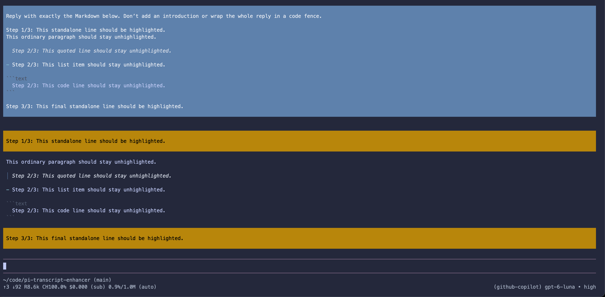

# Pi Transcript Enhancer

This extension highlights assistant progress lines that match configured
phrases, rendering them in ordered deep-gold blocks with black text. Other
assistant Markdown stays in sequence around them. The original assistant
message remains unchanged and is the only content sent to the model.



## Configure

Edit `.pi/transcript-highlights.json` in this checkout. After a global install
with `pi install git:github.com/Integralist/pi-transcript-enhancer`, edit that
file in the installed checkout. With the default agent directory, the checkout
is `~/.pi/agent/git/github.com/Integralist/pi-transcript-enhancer/`. If
`PI_CODING_AGENT_DIR` is set, replace `~/.pi/agent` with its value.

```json
{
  "phrases": ["Step", "Phase"]
}
```

Each phrase is a line label. Up to three leading spaces are allowed. A
highlight requires a standalone line in the form
`<phrase> <integer>/<integer>: <non-empty summary>`. For example,
`Phase 2/4: Implement the renderer` matches. An empty array disables
highlights. Missing or malformed configuration falls back to `Step`; blank and
non-string labels are ignored. The file is read when the extension loads; run
`/reload` after changing it.

Lines inside fenced code, blockquotes, list items, or indented blocks are not
matched.

## Load and test

From the project root, load the extension directly:

```bash
pi --no-extensions --extension ./.pi/extensions/step-highlight/index.ts
```

The extension also loads automatically from `.pi/extensions/` after project
trust is granted. Run the behavior tests with:

```bash
node --test test/step-highlight.test.mjs
```
